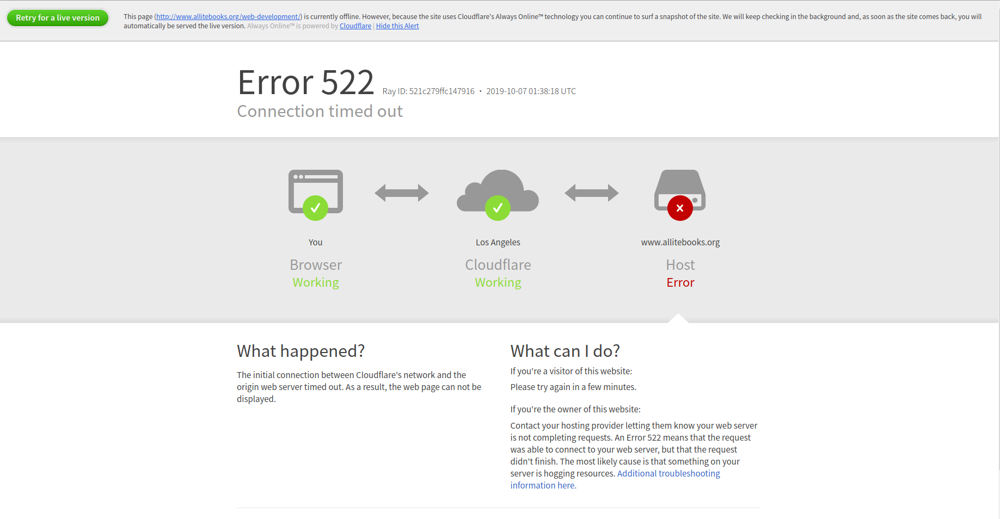
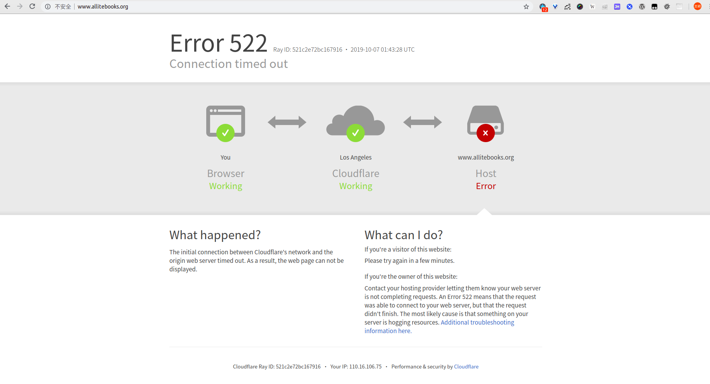

# [IT电子书爬虫](./allite_books.js "IT电子书爬虫") 
[电子书网址](https://www.allitebooks.org "网址") 

## 项目描述：
> 抓取这个网站的全部电子书信息(包括电子书的下载地址)，存入数据库。结果在大规模爬取时，意外发生了，网站承受不了这么大的压力。

首页也不能访问了：
　

根据网站域名可知这是一个公益性网站，因此项目更多是技术方面的探讨，不会进行大规模抓取。

## 项目结构：
```bash
e-books
├── allite_books.js　　// 实例文件
├── allitebooks.MD　　// 说明文件
└── Books.js　　// 项目模块
```
